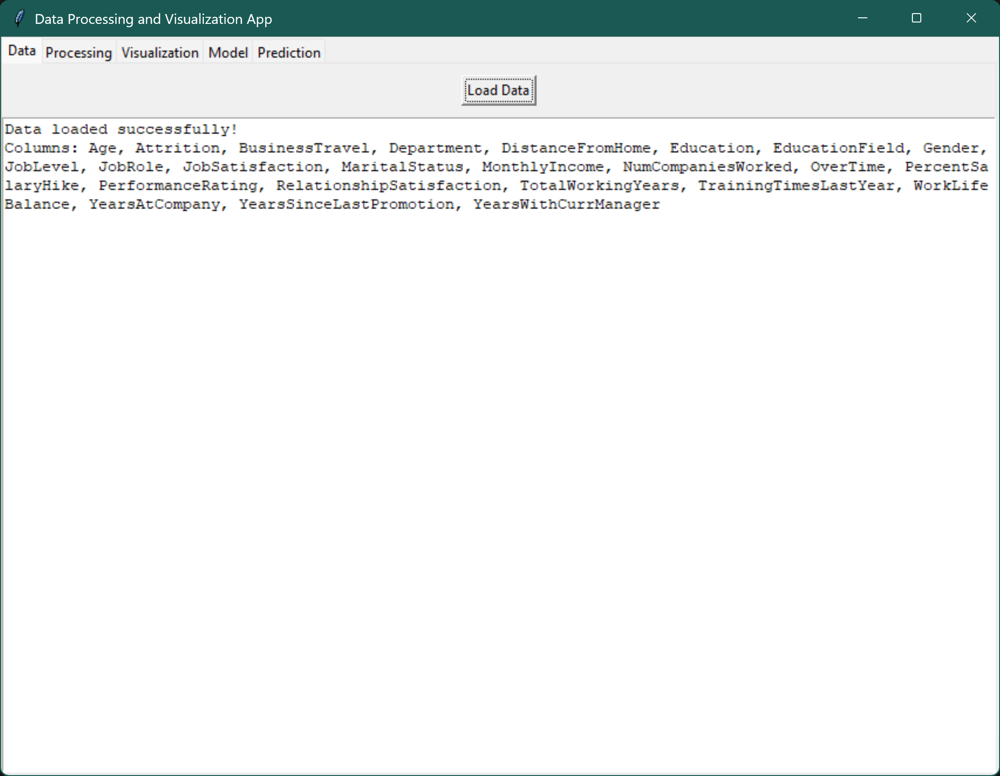
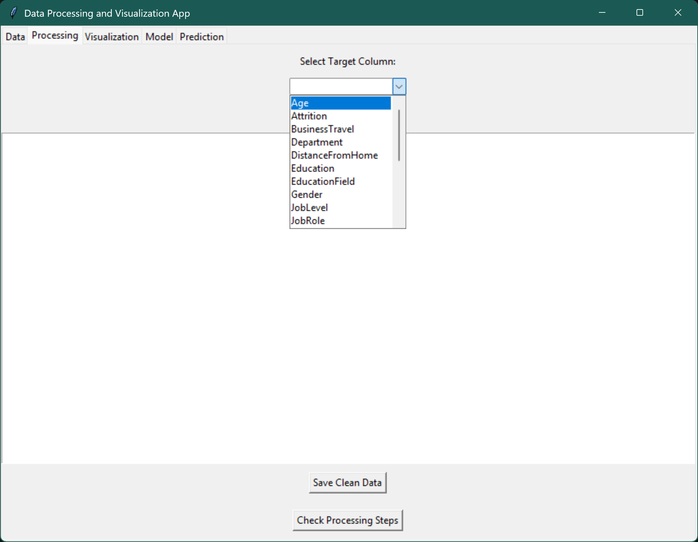
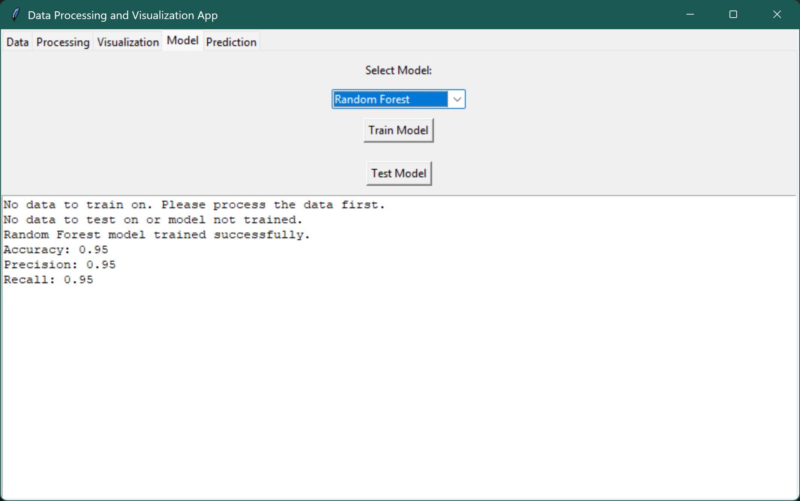
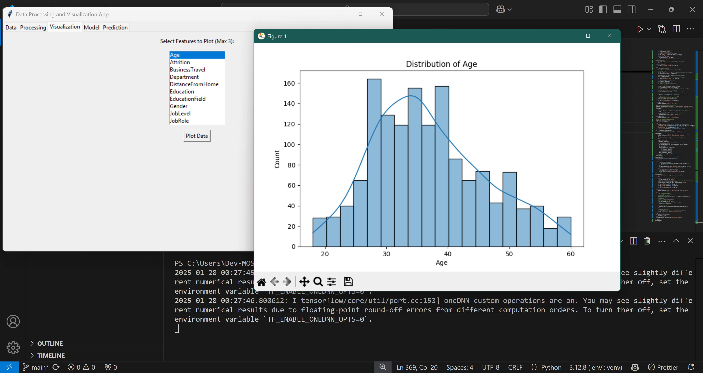
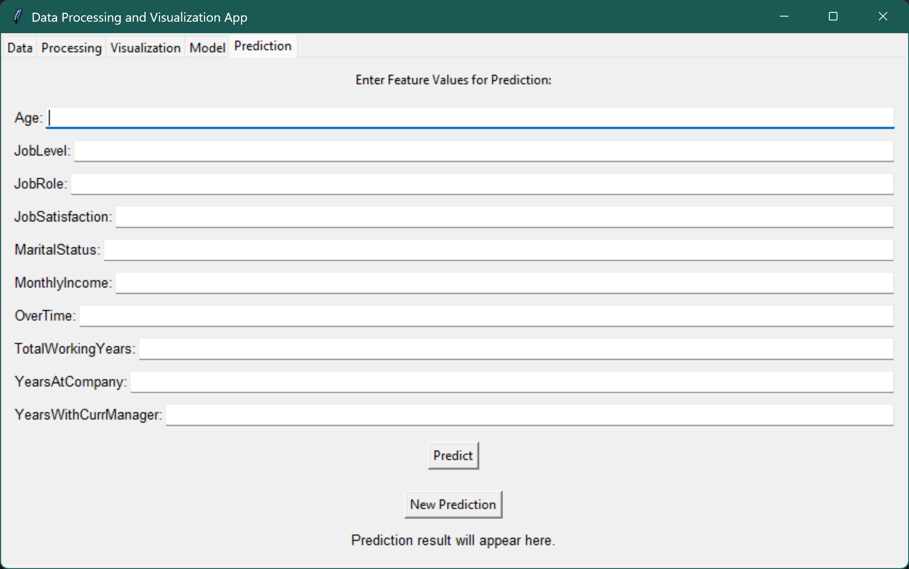

# Data Processing and Visualization App

This is a **Python-based application** designed for data processing, visualization, and machine learning predictions. It provides a user-friendly interface built with **streamlit** for loading, processing, and analyzing datasets. The application also supports training and testing machine learning models, as well as making predictions based on user input.

**Advanced Data Processing & Predictive Modeling Toolkit**

[](https://www.python.org/)
[](https://streamlit.io/)
[](LICENSE)

---

## Features

- **Data Loading**: Load datasets in CSV or Excel formats.

- **Data Processing**:
  - Handle missing values by dropping rows with null values.
  - Encode categorical and target columns using Label Encoding.
  - Balance datasets using Random Over-Sampling.
  - Perform feature selection to identify the most relevant features.

   **Algorithm Choices**:
  - Random Forest (Customizable trees/depth)
  - Neural Networks (Flexible architecture builder)

- **Performance Metrics**:
  - Accuracy, Precision, Recall, F1-Score
  - Interactive Confusion Matrix
  - Classification Report


- **Data Visualization**:
  - Plot histograms, scatter plots, and 3D scatter plots for up to 3 features.

- **Machine Learning**:
  - Train and test machine learning models (Random Forest or Deep Learning).
  - Evaluate model performance using accuracy, precision, and recall metrics.
- **Prediction**
- **Single Prediction**: Interactive input form with real-time results
- **Batch Prediction**: CSV upload with downloadable results
- **Confidence Scores**: Probability visualization for predictions

---

## Screenshots

### Main Interface



### Data Processing



### Model Training



### Data Visualization



### Prediction Tab



---

## Requirements

To run this application, you need the following:

- **Python 3.x** (Download and install Python from [here](https://www.python.org/downloads/)).
- **Libraries**:
  - `pandas`
  - `scikit-learn`
  - `tensorflow`
  - `matplotlib`
  - `seaborn`
  - `tkinter`
  - `imblearn`
  - `numpy`

---

## Installation

Follow these steps to set up and run the application:

### 1. Clone the Repository

First, clone the repository to your local machine:

```bash
git clone https://github.com/Eng-Mosab-Alhopishi/Data-Sciences-Analyzer-App.git
# git clone https://github.com/radanpro/data-science.git
```

<!-- ```bash
git clone https://github.com/radanpro/data-science.git
``` -->

### 2. Navigate to the Project Directory

Move into the project folder:

```bash
cd Data-Sciences-Analyzer-App
```

### 3. Set Up a Virtual Environment (Optional but Recommended)

To avoid conflicts with other Python projects, create a virtual environment:

```bash
python -m venv venv
```

Activate the virtual environment:

- On Windows:

  ```bash
  venv\Scripts\activate
  ```

- On macOS/Linux:

  ```bash
  source venv/bin/activate
  ```

### 4. Install Required Libraries

Install the required libraries using the `requirements.txt` file:

```bash
pip install -r requirements.txt
```

or
Alternatively, you can install the libraries manually:

```bash
pip install pandas scikit-learn tensorflow matplotlib seaborn imblearn numpy
```

### 5. Run the Application

Once the libraries are installed, run the application:

```bash
streamlit run  main.py
```

---

## Usage

1. **Load Data**  
   Click on the "Load Data" button to upload your dataset (CSV or Excel).

2. **Process Data**  
   Select the target column from the dropdown menu.  
   Click "Start Processing" to clean, encode, and balance the dataset.

3. **Visualize Data**  
   Select up to 3 features from the list.  
   Click "Plot Data" to generate visualizations.

4. **Train Model**  
   Choose a model (Random Forest or Deep Learning).  
   Click "Train Model" to train the selected model.

5. **Test Model**  
   Click "Test Model" to evaluate the model's performance.

6. **Make Predictions**  
   Enter feature values in the prediction tab.  
   Click "Predict" to see the prediction result.  
   Click "New Prediction" to clear the input fields and reset the result.

---

## File Structure

Here’s an overview of the project structure:

```
repository-name/
│
├── main.py                # Main application script
├── requirements.txt       # List of required libraries
├── README.md              # Project documentation
├── LICENSE                # License file
├── .gitignore             # Files to ignore in Git
├── data/                  # Folder for sample datasets (optional)
└── images/                # Folder for screenshots (optional)
```

---

## License

This project is licensed under the MIT License. See the `LICENSE` file for details.

---

## Contributing

Contributions are welcome! If you'd like to contribute, please follow these steps:

1. Fork the repository.
2. Create a new branch for your feature or bugfix.
3. Commit your changes.
4. Push your changes to the branch.
5. Submit a pull request.

---

## Contact

For any questions or feedback, feel free to reach out:

- **Email**: your-email@example.com
- **GitHub**: your-username

---

### How to Use This `README.md`

1. Copy the content above into a file named `README.md` in your project folder.
2. Replace placeholders like `username`, `repository-name`, and `your-email@example.com` with your actual details.
3. Add screenshots of your application to the `images/` folder and link them in the **Screenshots** section.
4. Push the updated `README.md` to your GitHub repository.

---

### Example of a Screenshot Section

If you want to add screenshots, you can use the following format in the **Screenshots** section:

```markdown
## Screenshots

### Main Interface


### Data Visualization


### Prediction Tab


```
